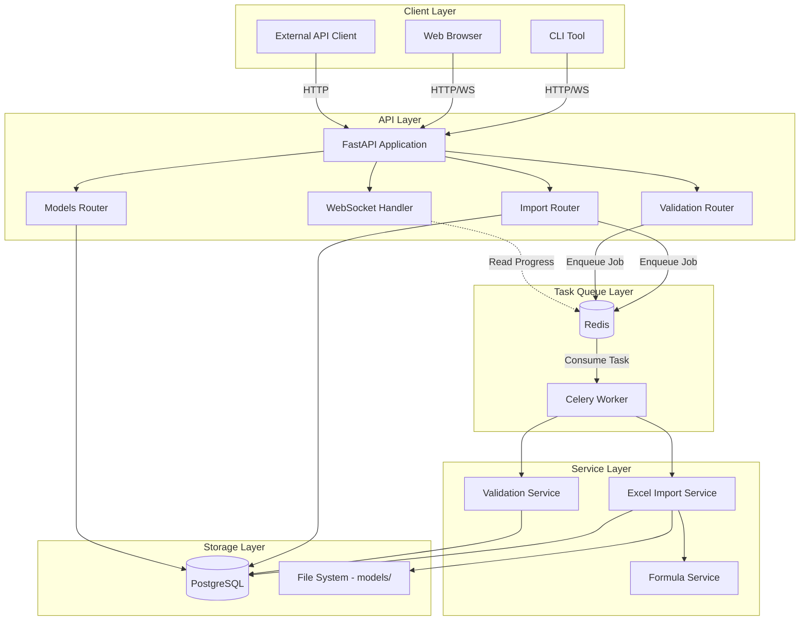
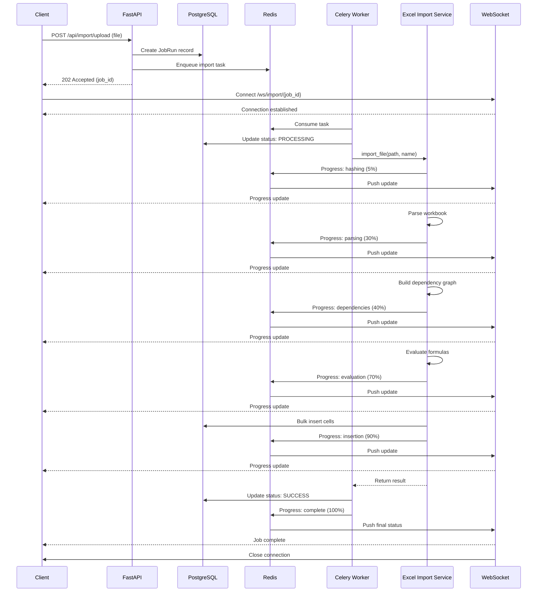
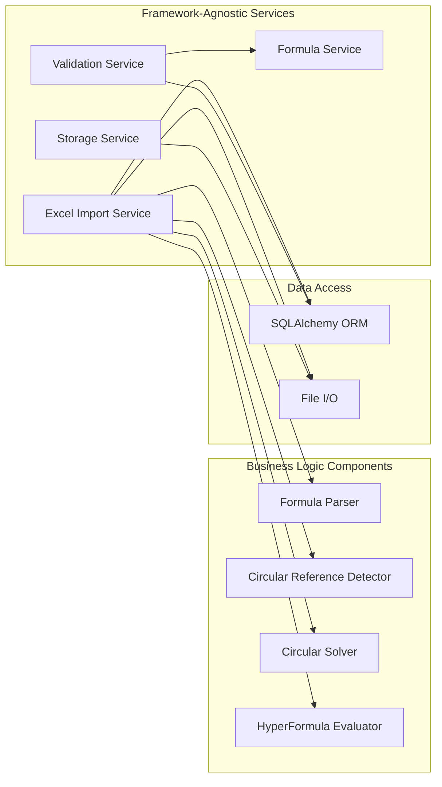
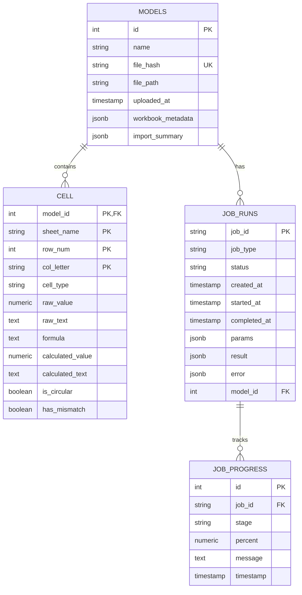
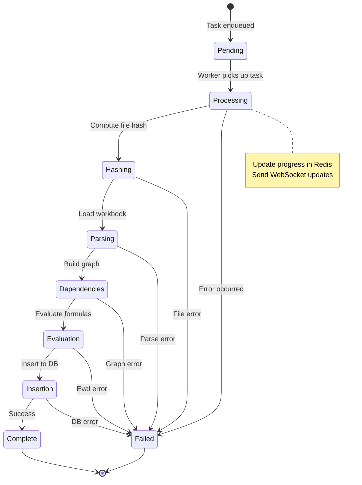
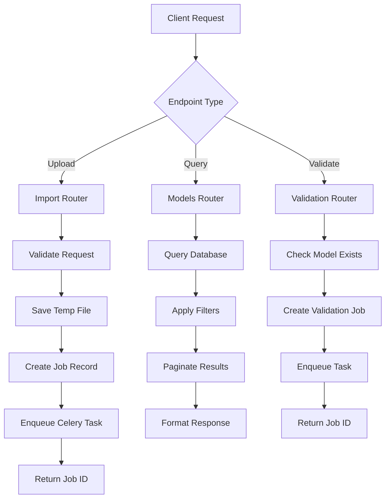
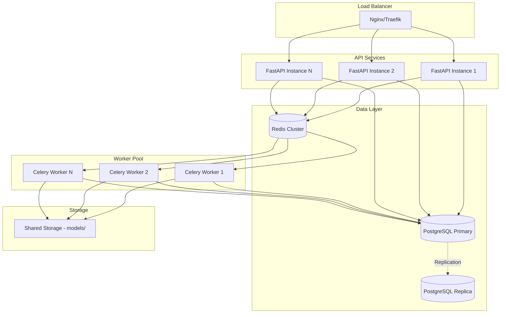
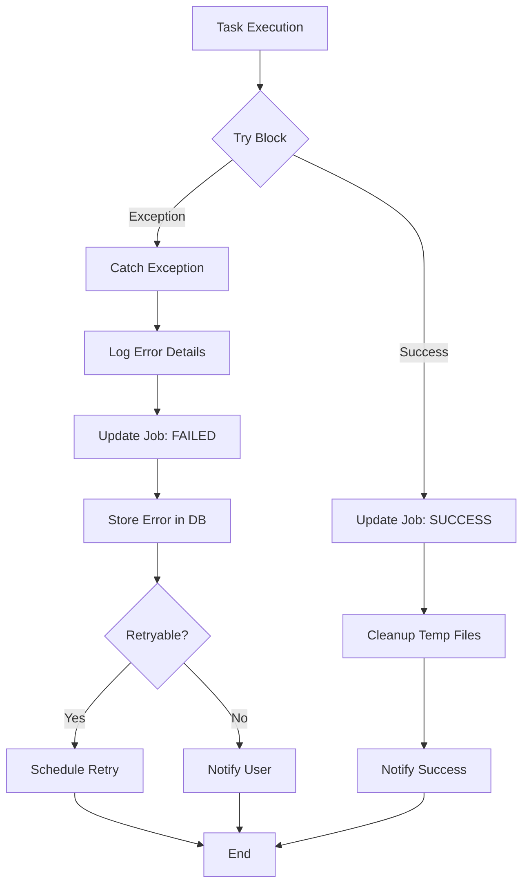
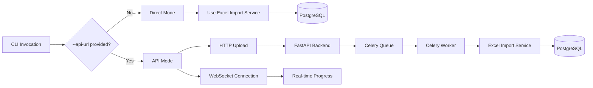

# FastAPI Migration - Architecture Diagrams

This document provides visual representations of the new architecture using Mermaid diagrams.

---

## System Overview

---

## Import Workflow

---

## Service Layer Architecture

---

## Database Schema

---

## Celery Task Flow

---

## Progress Stages

```mermaid
gantt
    title Import Job Progress Stages
    dateFormat X
    axisFormat %s
    
    section File Processing
    Hashing           :0, 5
    Parsing           :5, 25
    
    section Analysis
    Dependencies      :25, 15
    
    section Evaluation
    Formula Eval      :40, 40
    
    section Database
    Insertion         :80, 15
    Validation        :95, 5
```

---

## API Request/Response Flow

---

## Deployment Architecture

---

## Error Handling Flow

---

## CLI Dual-Mode Operation

---

**Version:** 1.0  
**Last Updated:** 2025-10-15